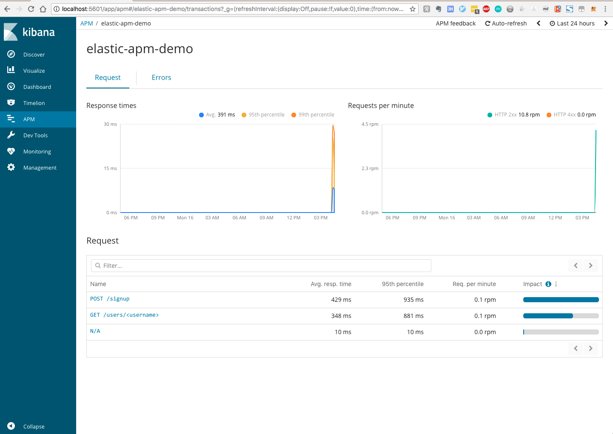
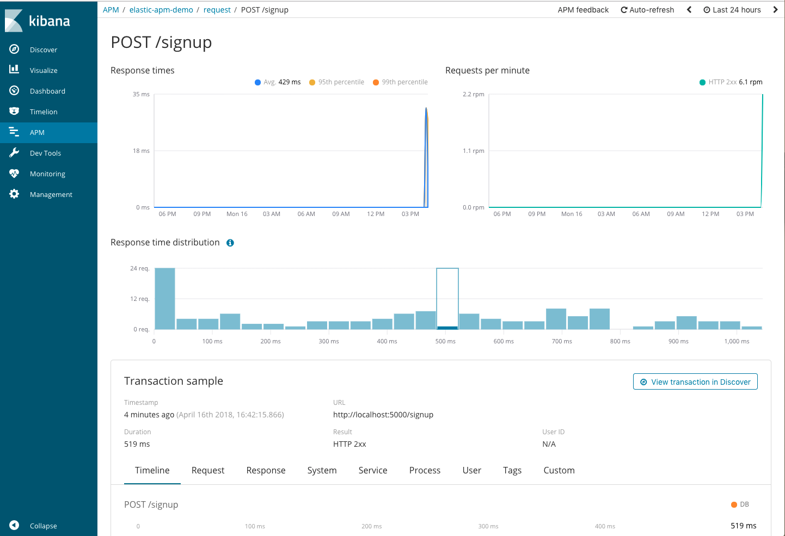
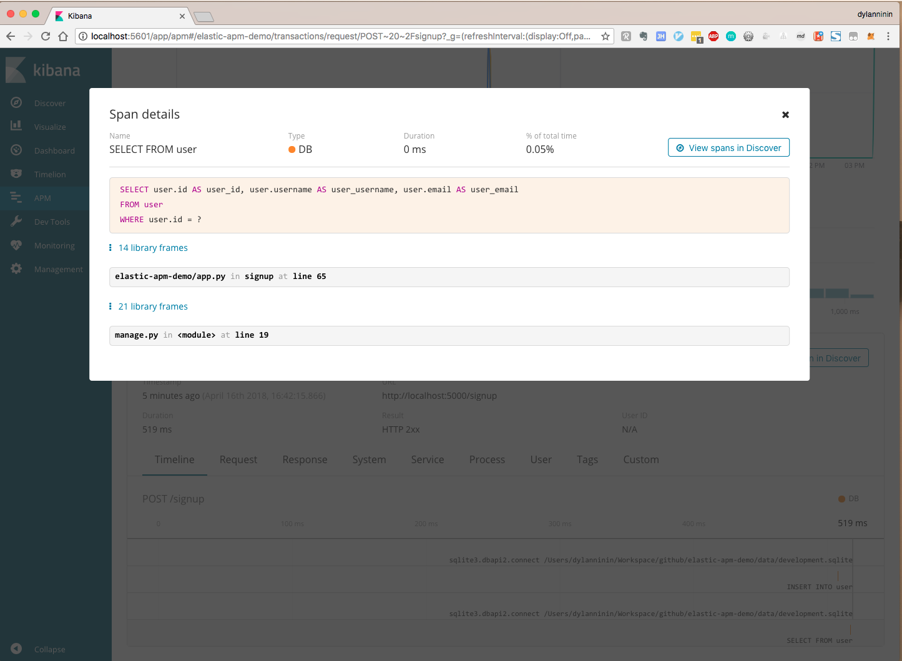
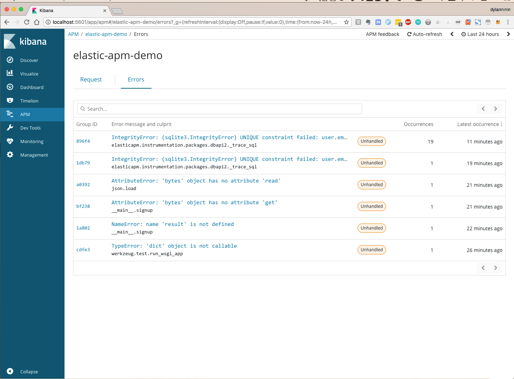
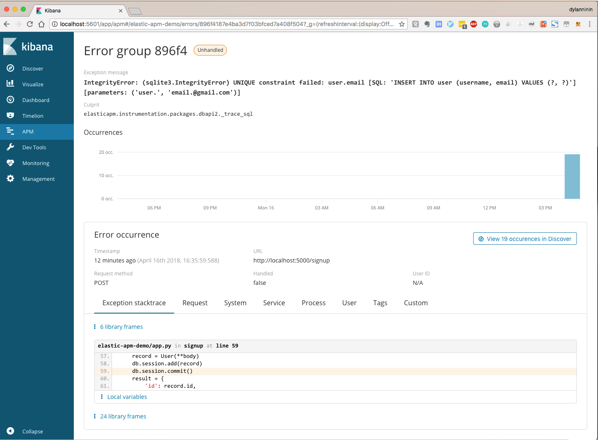
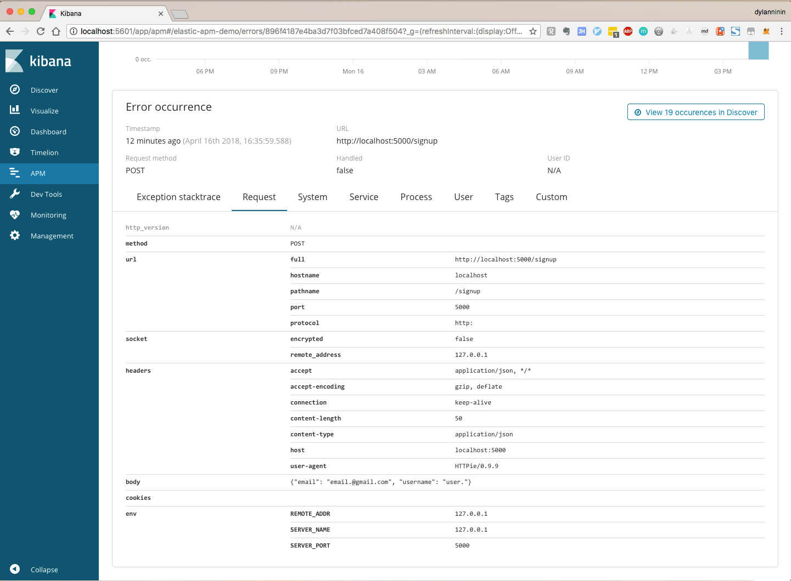

Elastic APM Demo

#### Introduction

Backend related projects will always integrate some essential services, e.g.:

- Sentry as logging stream, see [pricing]([Sentry Pricing](https://sentry.io/pricing))
- Newrelic as Performance monitor, see [pricing](https://newrelic.com/application-monitoring/pricing)
- Elasticsearch as full-text search, it's open-source and free

And now you can centralize it all into the Elastic Stack.

Quote from https://www.elastic.co/solutions/apm:

> Already housing logs and system metrics in Elasticsearch? Expand to application metrics with Elastic APM. Four lines of code lets you see a bigger picture to quickly fix issues and feel good about the code you push.

> Have security events? Website or server logs? Documents with tons of text? Centralize it all into the Elastic Stack to expand your analyses, lower operational costs, and make your use case even richer.

#### Getting started

- run elastic apm: `docker-compose -f elastic-apm/docker-compose.yml up -d`
- wait for several seconds, and then open: `http://localhost:5601/app/apm`
- install requirements: `pip install -r requirements.txt`
- initialize database to setup schema: `./manage.py init_db`
- run python agent to upload data: `./manage.py runserver`
- submit some requests:
  - signup: `for i in $(seq 100); do http :5000/signup email="${i}@email.domain" username="${i}"; done`
  - profile: `for i in $(seq 100); do http ":5000/users${i}"; done`

#### Screenshot

- APM index

- Request

- Transaction

- Error

- Error: Detail

- Error: Request

#### Reference
- [Open Source APM with Elasticsearch](https://www.elastic.co/solutions/apm)
- [Flask support | APM Python Agent](https://www.elastic.co/guide/en/apm/agent/python/2.x/flask-support.html)
- [Digital Performance Monitoring and Management | New Relic](https://newrelic.com/)
- [Sentry | Error Tracking Software — JavaScript, Python, PHP, Ruby, more](https://sentry.io/welcome/)
